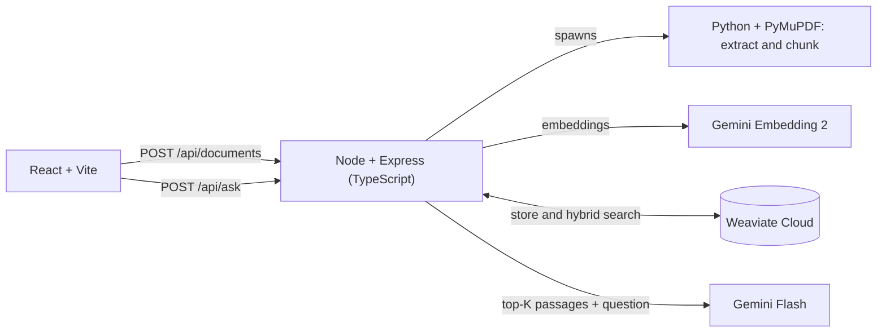

# DocuMind AI

Ask questions about your technical PDFs and get answers that cite the document and page they came from. If the answer is not in your documents, DocuMind says so instead of guessing.


## What it does

- Upload several PDFs and search across all of them.
- Answers are written by Gemini Flash using **only** the passages retrieved from your documents.
- Every statement carries a highlighted citation number. A margin note shows the document and page, and a "Show passage" button reveals the exact text.
- Refuses to invent answers when the evidence is missing.

## How it works



**Ingestion:** PDF, then page-by-page text extraction, then overlapping chunks (about 2,800 characters with 300 overlap), then embeddings, then Weaviate.

**Answering:** question, then embedding, then hybrid search (vector similarity plus BM25 keyword search), then the top 5 passages, then Gemini Flash, then an answer with citations.

## Tech stack

| Area | Technology |
|---|---|
| Frontend | React, Vite, TypeScript, plain CSS |
| Backend | Node.js, Express, TypeScript |
| Document processing | Python, PyMuPDF |
| Embeddings | Google Gemini Embedding 2 |
| Vector database | Weaviate Cloud (hybrid search) |
| LLM | Google Gemini Flash |

## Architecture

The backend is layered so each file has one job:

```text
routes  ->  controllers  ->  services  ->  repositories / clients
```

```text
backend/src
  routes/        maps web addresses to controllers
  controllers/   reads the request, sends the response
  services/      the logic: ingest, retrieve, generate, ask
  repositories/  knows how chunks are stored and searched in Weaviate
  clients/       talks to outside systems: Gemini, Weaviate, Python
  middleware/    uploads and error handling
  config/        reads and validates settings
  types/         shared data shapes
frontend/src
  api/           the only place that calls the backend
  hooks/         logic and state
  components/    what you see
processing/      Python: PDF extraction and chunking
```

## Getting started

### Prerequisites

- Node.js (LTS) and Python 3
- A [Google AI Studio](https://aistudio.google.com) API key
- A [Weaviate Cloud](https://console.weaviate.cloud) cluster and an API key with the admin role

### Setup

```bash
git clone https://github.com/YOUR-USERNAME/documind-ai.git
cd documind-ai

# Python dependency
python -m pip install -r processing/requirements.txt

# Backend and frontend dependencies
cd backend && npm install && cd ..
cd frontend && npm install && cd ..
```

Copy `.env.example` to `.env` in the project root and fill in your three keys.

### Run

Use two terminals:

```bash
# Terminal 1
cd backend
npm run dev

# Terminal 2
cd frontend
npm run dev
```

Open http://localhost:5173, add a PDF, and ask a question.

## API

| Method | Path | Purpose |
|---|---|---|
| GET | `/api/health` | Server and database status |
| POST | `/api/documents` | Upload a PDF (multipart form, field name `file`) |
| POST | `/api/ask` | Body: `{ "question": "..." }`. Returns `{ answer, sources }` |

## Design decisions

- **Hybrid retrieval.** Vector search handles meaning, while BM25 catches exact technical terms like `fork()` or `MVCC`. The mix is one setting (`hybridAlpha`).
- **Page-aware chunking.** Chunks never cross page boundaries, so every citation points to one real page.
- **Grounding in two layers.** If nothing is retrieved, the model is never called. Otherwise the model is told to answer only from the excerpts and to reply `NOT_FOUND` when they are insufficient.
- **Untrusted document text.** Retrieved excerpts are treated as data. The model is told never to follow instructions found inside them.
- **Fail fast.** The server refuses to start if a required setting is missing or the database cannot be reached.

## Limitations

- Text-based PDFs only. There is no OCR, so scanned documents are rejected.
- No authentication and no chat memory. Each question is independent.
- Original PDFs are stored on local disk.
- Page numbers are the PDF's page order, which may differ from printed page numbers.
- The refusal behaviour depends on the model following its instructions. It is strong but not a guarantee.

## Ideas for later

Reranking, a small evaluation set with automatic scoring, cloud file storage, authentication and rate limiting.